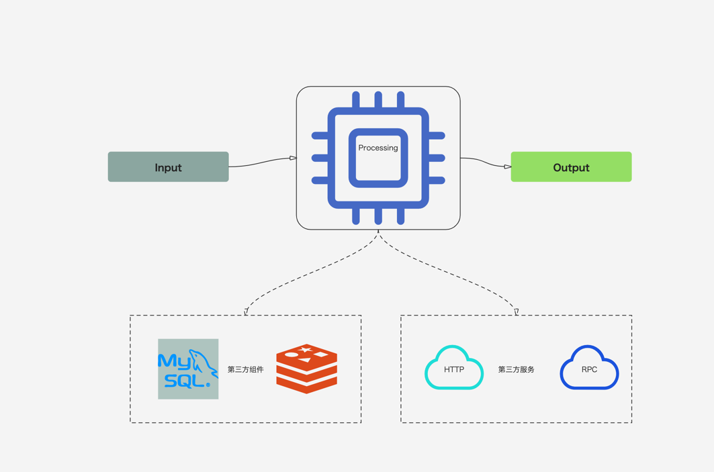

# gmock原理介绍及使用
Author：junqiang.zhang

---

## 单元测试的目的是什么？

> 保证代码质量
>
> 保证代码的可维护
>
> 保证代码的可扩展

---

## 如何写单元测试？


```golang
func Add(a,b int)int {
 
   return a+b
}


func main() {

  s:=Add(1,4)
  if s!=5 {
    panic("Add Fail")
  }

}


```

---


## 传统的单元做法是怎么做的？[mock](https://github.com/golang/mock)
```golang
// Interface
type Foo interface {
  Bar(x int) int
}

func SUT(f Foo) {
 // ...
}

```

---

## 传统的单元做法是怎么做的？[mock](https://github.com/golang/mock)


```golang 
// Mock Interface
func TestFoo(t *testing.T) {
  ctrl := gomock.NewController(t)
  defer ctrl.Finish()
  m := NewMockFoo(ctrl)
  m.EXPECT().Bar(gomock.Eq(99)).
    DoAndReturn(func(_ int) int {
      time.Sleep(1*time.Second)
      return 101
    }).
    AnyTimes()
  SUT(m)
}
```

----

## 实际情况(MVC)

```golang 
//Controller
type Jira struct {
	JiraService *service.Jira
	//JiraRepo    dependency.JiraRepo
}
func (j *Jira) PostList(ctx context.Context, req *dto.JiraQueryReq) rest.Response {
	jiraList, total, message, err := j.JiraService.Query(ctx, req)
	resp := dto.NewResponseDto(err)
	if err != nil {
		return resp
	}
	resp.SetData(jiraQueryDTO(jiraList, total, message))
	return resp
}


```

---

## 实际情况

```golang 
//Service
type Jira struct {
	JiraFactory       *aggregate.JiraFactory
	FlowFactory       *aggregate.FlowFactory
	FlowTemplateRepo  dependency.FlowTemplateRepo
	GroupConfRepo     dependency.GroupConfRepo
	JiraOperationRepo dependency.JiraOperationRepo
  JiraRepo    dependency.JiraRepo
}

func (j *Jira) Query(ctx context.Context, req *dto.JiraQueryReq) ([]*entity.Jira, int, string, infra.Exception) {
	cmd, _ := j.JiraFactory.NewJiraQueryCmd(ctx)
	return cmd.Query(req)
}
```

---

## 实际情况

```golang
// Aggregation
type JiraFactory struct {
	JiraRepo          dependency.JiraRepo
	JiraOperationRepo dependency.JiraOperationRepo
}

func (j *JiraFactory) NewJiraQueryCmd(ctx context.Context) (*JiraQueryCmd, error) {
	return &JiraQueryCmd{
		jiraRepo:          j.JiraRepo,
		jiraOperationRepo: j.JiraOperationRepo,
		ctx:               ctx,
	}, nil
}

```

---


## 实际情况

```golang
// dependency
type JiraRepo interface {
	GetByJiraId(ctx context.Context, jiraId int) (*entity.Jira, infra.Exception)
}


```

---

## 实际情况

```golang
// Repo
type Jira struct{

}

func (repo *Jira) GetByJiraId(ctx context.Context, jiraId int) (jiraEntity *entity.Jira, e infra.Exception) {
	jiraEntity = &entity.Jira{}
	jiraEntity.JiraId = jiraId
	err := findJiraTab(ctx, jiraEntity)
	if err != nil {
		e = parseErr(err)
	}
	return
}

```

---


##  为什么传统的单元测试很难持续实施？
> 接口隔离
>
> 分层测试
>
> 使用Mock

---

## 思考？
> 如何让单元测试变得简单？
>
> 如何保证单元测试是有效的？
>
> 如何保证单元测试可持续？
>
> 如何让开发喜欢单元测试？

---

## 解决方案 ？

> https://github.com/sjqzhang/gmock




